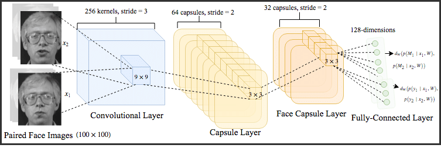

<div class="ui small rounded images">
  
  
  
  
</div>

Image recognition using CNN and CN is the ability of a machine learning model to identify objects, places, people, writing and actions in images. Computers can use computer vision technologies in combination with a camera and artificial intelligence software to achieve image recognition.

A Convolutional Neural Network (ConvNet/CNN) is a Deep Learning algorithm which can take in an input image, assign importance to different aspects/objects within the image and be able to differentiate one from the other. CNN is used as the default model to deal with images and handles images in differen ways however still it follows the general concept of Neural Networks whenever the neurons are made up of learnable weights and biases. Each neuron takes the image pixel as the input and performs a dot product operation so that each element of the same height/width is multiplied with the same weight and they are summed together. CNN works based on the hidden layers and the fully connected layers.

```javascript
# A common Conv2D model
input_image = Input(shape=(None, None, 3))
x = Conv2D(32, (3, 3), activation='relu')(input_image)
x = Conv2D(64, (3, 3), activation='relu')(x)
#x = Conv2D(128, (3, 3), activation='relu')(x)
x = AveragePooling2D((2, 2))(x)
x = Conv2D(128, (3, 3), activation='relu')(x)
#x = Conv2D(512, (3, 3), activation='relu')(x)
x = Dense((512))(x)
```

The dataset for our project would be 3D images and the CNN architecture would look like the above code snippet where we are using the Relu Activation Layer, Average Pooling and a Dense Layer. There are many different layers but this what our CNN architecture looks like and we would not go in depth of each layer as we will explain the layers we have used for our project.


Capsule Network(CapsNet/CN) is made of capsules rather than neurons. A capsule is a small group of neurons that learns to detect a particular object within a given region of the image, and it outputs a vector whose length represents the estimated probability that the object is present in that region, and the pose parameters of objects are encoded from orientation of object. If the object is changed slightly then the capsule will output a vector of the same length, but oriented slightly differently.

```
x = Reshape((-1, 128))(x)
capsule = Capsule(10, 32, 3, True)(x)
output = Lambda(lambda z: K.sqrt(K.sum(K.square(z), 2)))(capsule)
model = Model(inputs=input_image, outputs=output)

# we use a margin loss
#adam = K.optimizers.Adam(lr=0.001)
model.compile(loss=margin_loss, optimizer='adam', metrics=['accuracy'])
model.summary()
```
