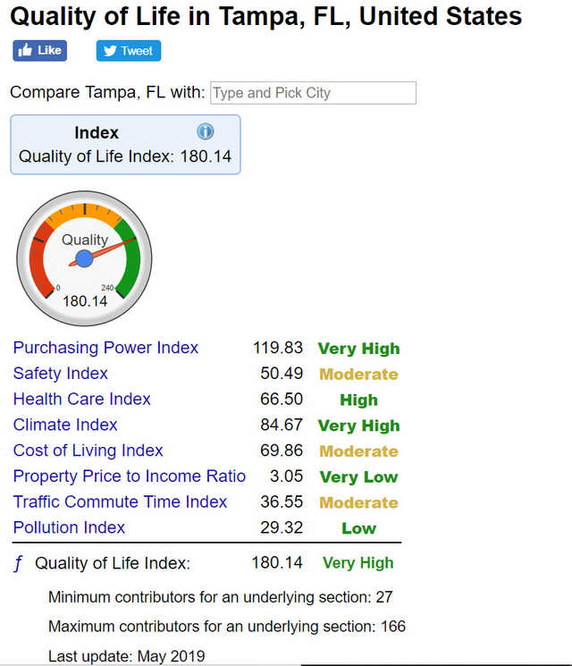

Numbeo is the world’s largest database of user contributed data about cities and countries worldwide. Numbeo provides current and timely information on world living conditions including cost of living, housing indicators, health care, traffic, crime and pollution.

Open Street Map 

In this project I gained experience with hadoop ecosystem, mapreduce algorithms, run mapreduce jobs in PIG scripts, including MongoDB for database storage and Spark for mapping and reducing spatial joins based on locations. 

Crawled data from web sources OpenStreetMap and Numbeo using Jsoup to extract OSM data to MongoDB. Executed Map-Reduce algorithm on 100 GB data and map it to required tokens to perform quantitative analytics. Implemented Spatial Join function to get details of city and speeding up polygon query using Spatial Hadoop.

 
Source: <a href="https://github.com/johailsherieff/ranking"><i class="large github icon"></i>theVacay/vacay</a>
