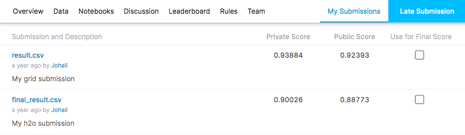

Facebook and kaggle launced a compititon in 2015 to detect the bot activity from an online auction. Human bidders were getting frustrated with the inability to win auctions because of their software controlled opponents. So the objective of this competition is to classify which bids are made by bots and which bids are made by humans. Intially in the training set I had 9 columns giving a brief idea about the auctions. Before building the machine learning model I perfomed feature engineering to help classification model get better picture of the auction. Initially I was using H2O AutoML to test the our predictions and get idea about how our feature engineering resulted. After running the model on H2O and also ran the model using scikit learn libraries.

I implemeted the following models - Gradient Boosting machine , Extreme Gradient Boosting, Random forest, Adaptive boosting, Caliberative classifier and Bagging classifier.

I trained and designed multiple machine learning models. The main objective of the challenge was to classify whether the bidder is a human or bot. The feature engineering improved the performance of all models. I trained models with and without hyperparameter tuning. After hyper parameter tuning the model imporved even better. For our base model was a XGBoost of 15 iterations to get an AUC of 0.938 and on private leaderboard it places us on 15th position. So to improve the AUC tuned the hyper parameters of various models as a ensemble of models, after hyperparameter tuning the best AUC was 0.9388 and on private leaderboard I stand at 12th position.

Source: <a href="https://github.com/johailsherieff/Facebook_IV_Human_or_Bot-Kaggle_Competition/Assignment_2_HumanVsBot_Kaggle.ipynb"><i class="large github icon "></i>Python Notebook Is Available</a>

